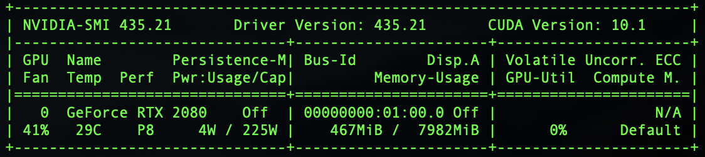

# dl-machine-setup

## Hardware Setup:
- Motherboard: [Asus - ROG STRIX Z490-E](https://www.asus.com/us/Motherboards/ROG-STRIX-Z490-E-GAMING/wheretobuy/) - $300.
- Ram: [Corsair - VENGEANCE® LPX 16GB (2 x 8GB) DDR4 DRAM 3000MHz C15 Memory Kit](https://www.corsair.com/us/en/Categories/Products/Memory/VENGEANCE-LPX/p/CMK16GX4M2B3000C15) - $68.99
- CPU: [Intel - Core i5-9400 9th Generation](https://www.bestbuy.com/site/intel-core-i5-9400-9th-generation-6-core-6-thread-2-9-ghz4-1-ghz-turbo-socket-lga-1151-locked-desktop-processor/6342753.p?skuId=6342753&ref=212&loc=1&extStoreId=1104&ref=212&loc=1&gclid=EAIaIQobChMIyI6Y-KuR6wIVXiCtBh27JQ0GEAQYAiABEgLKT_D_BwE&gclsrc=aw.ds) - $149.99
- SSD: [Samsung - 970 EVO Plus](https://www.bestbuy.com/site/samsung-970-evo-plus-1tb-internal-pci-express-3-0-x4-nvme-solid-state-drive-with-v-nand-technology/6324470.p?skuId=6324470) - $229.99
- GPU: [Nvidia GeForce RTX 2080](https://www.bestbuy.com/site/nvidia-geforce-rtx-2080-super-8gb-gddr6-pci-express-3-0-graphics-card-black-silver/6361326.p?skuId=6361326) - $699.99
- Power Supply: [Corsair - CX Series Modular CX750M](https://www.bestbuy.com/site/corsair-cx-series-modular-cx750m-750w-80-plus-bronze-atx-power-supply-black/8324202.p?skuId=8324202) - $124.99

Total Cost: Too Much!  
I accidentally picked the most expensive motherboard on display, becuase it was put on the wrong shelf with wrong price tag. I assume any motherboard with PCIe interface would work.  
I also use my machine for data storage, so I chose SSD with with a bit more disk space.  
As far as I know, RTX 2080 is the cheapest GPU from Nvidia that's compatible with Cuda, and has decent performance.  

## Operating System:
I use Ubuntu 18.04.1 with x86_64 architecture.  

## GPU Setup:
1. Install driver like [this one][https://www.nvidia.com/download/driverResults.aspx/150803/en-us] or newer version. 
2. Install Cuda based on machine's operating system and architecture.

In terminal type:  
```nvidia-smi```  
It should display driver and cuda version.  



## Configure for Remote Operation:
Install Open SSH Server:  
```sudo apt install openssh-server```  
Once installed, a daemon is created to listen to connection requests.  
To make it's running, type:  
```sudo systemctl status ssh```  

## Firewall Setup:
We have to allow network traffic on port 22.
Depending on the operating system. Ubuntu has a user friendly interface called UFW (Uncomplicated Firewall) to configure network setting.  
It's disabled by default, but if it isn't, type:  
```sudo ufw allow ssh```  
To check the status of the firework:  
```sudo ufw status verbose```  

NOTE: This allows access to all the machines connected via the same network. 
If accessing from a different network, the router which the ssh sever connected to might need to be configured to forward the packet.

## Connecting to the Server:
Depending on the client machine, a ssh client might be necessary.
Get the ip address of ssh server machine:  
```ip a | grep inet```  
Pick the one that's on the wireless network. It has something like ```wlo1``` in the network description.  
The command to connect on the client machine looks something like:  
```ssh name_of_my_machine@10.0.189.229```  

## Miscellaneous:

